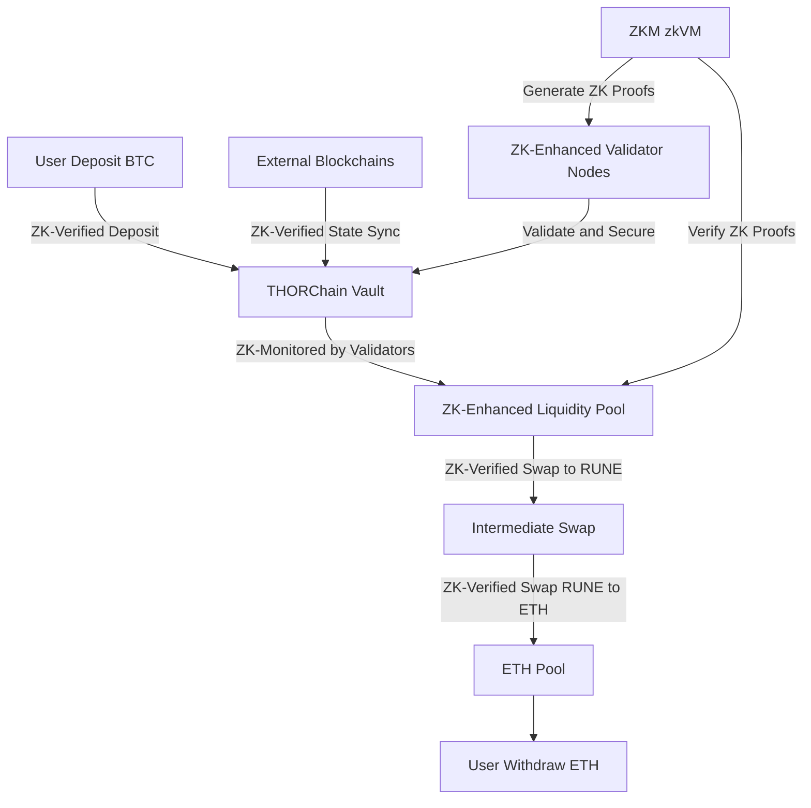
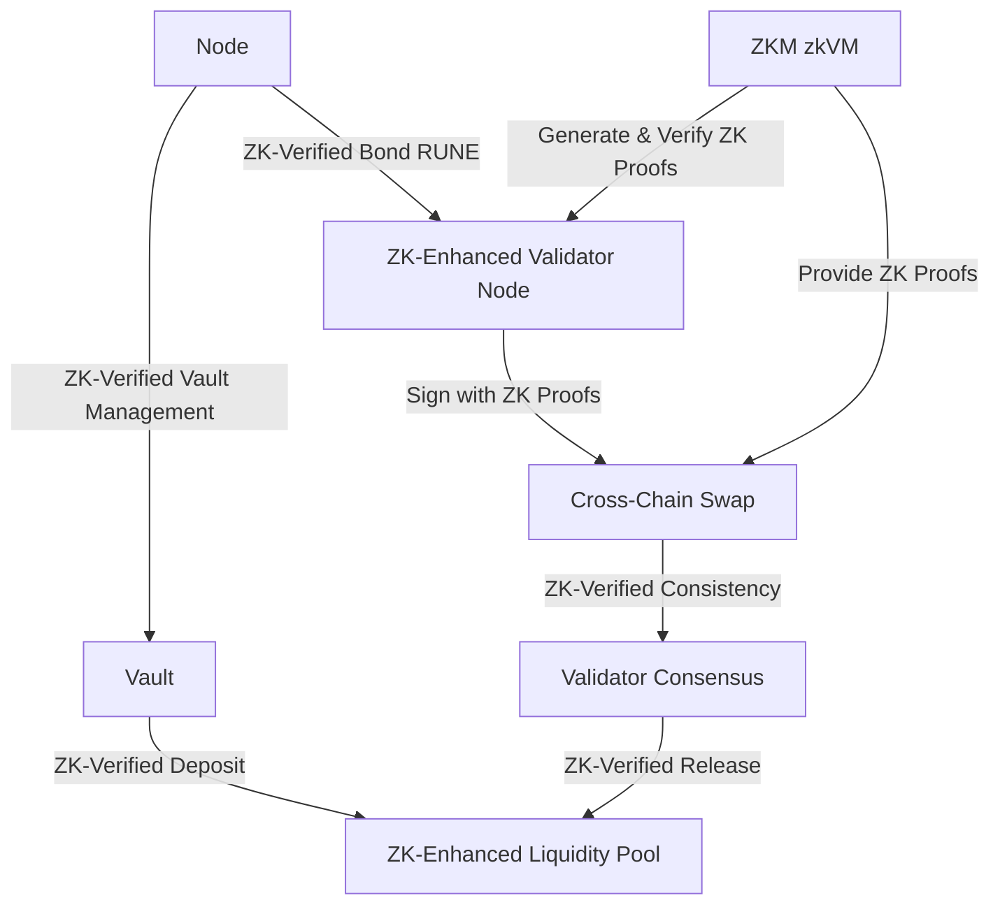

# THORChain with ZKM Integration

## Overview of the Category

THORChain, enhanced by Zero-Knowledge Machine (ZKM) integration, primarily falls under the **External Verification** category of settlement networks. It utilizes its own blockchain (THORChain) in addition to the chains where assets are transferred, making it externally verified. However, it also incorporates aspects of **Native Verification** through its direct interaction with connected chains.

### Category: Cross-Chain Decentralized Liquidity with Zero-Knowledge Proofs

THORChain's primary focus is providing liquidity across multiple blockchains, now enhanced by ZKM's zero-knowledge proofs for improved security and efficiency.

## Related Information

### Key Features of THORChain with ZKM Integration

1. **Cross-Chain Liquidity**: Users can swap native assets between blockchains without wrapping, now with added security from ZK proofs.
2. **Non-Custodial**: The network remains non-custodial, with ZKM enhancing the security of cross-chain transactions.
3. **RUNE as Settlement Token**: RUNE continues to act as an intermediary asset, with ZK proofs verifying its role in settlements.
4. **ZK-Enhanced Validator Nodes**: Nodes now use ZK proofs to validate swaps and secure vaults more efficiently.
5. **Privacy-Preserving Liquidity Pools**: ZKM integration allows for more private liquidity provision and swaps.

## Architectural Diagrams

### THORChain Cross-Chain Liquidity Flow with ZKM

### THORChain Node and Validator Interaction with ZKM

## Architectural Advantages

1. **Enhanced Security**: ZKM integration provides cryptographic proofs for all operations, significantly reducing the risk of fraudulent activities.
2. **Improved Privacy**: Zero-knowledge proofs allow for privacy-preserving transactions and liquidity provision.
3. **Efficient Cross-Chain Interoperability**: ZK proofs optimize the verification process for cross-chain swaps, potentially reducing latency.
4. **Scalability**: ZKM enables more efficient state transitions and proofs, allowing THORChain to handle increased transaction volumes.
5. **Reduced Validator Load**: ZK proofs can simplify validation processes, potentially lowering the computational requirements for validators.

## Architectural Disadvantages

1. **Increased Complexity**: Integrating ZKM adds another layer of complexity to an already complex system.
2. **Potential Performance Overhead**: While ZK proofs enhance security, they may introduce some computational overhead.
3. **Integration Challenges**: Seamlessly integrating ZKM with existing THORChain infrastructure could pose technical challenges.
4. **Higher Initial Setup Costs**: Implementing ZKM may require significant initial investment in development and infrastructure.
5. **Learning Curve**: Users and developers may need time to understand and trust the new ZK-enhanced processes.

## Categorization in Settlement Network Types

1. **External Verification**
    - THORChain primarily fits here as it uses its own blockchain for settlement.
    - ZKM enhances the external verification process with zero-knowledge proofs.
    
    **Related Projects**: Entangle, Initia, Omni, Cycle Network, Hyperlane
    
2. **Native Verification**
    - Aspects of THORChain's direct interaction with connected chains align with native verification.
    - ZKM integration allows for more efficient native verification on connected chains.
    
    **Related Projects**: Polymer, zkLink
    

## Conclusion

THORChain with ZKM integration represents an advanced cross-chain liquidity solution that leverages zero-knowledge proofs to enhance security, privacy, and efficiency. While primarily an externally verified system, it incorporates elements of native verification, positioning it as a hybrid solution in the settlement network landscape. The integration of ZKM addresses some of THORChain's previous limitations while introducing new complexities and opportunities for the protocol.

---

Resources 

1. https://github.com/thorchain/Resources/tree/master/Whitepapers 

2. https://kriptomat.io/cryptocurrency-prices/thorchain-rune-price/what-is/