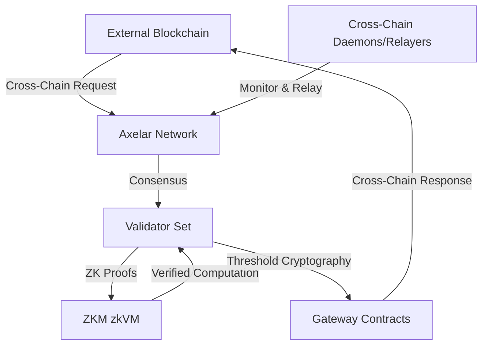
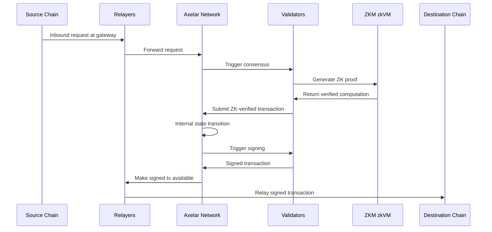

# Axelar Network with ZKM Integration

## Overview of the Category

Axelar is a decentralized interoperability network that enables secure cross-chain communication and asset transfers between multiple blockchain ecosystems. With the integration of Zero-Knowledge Machine (ZKM), it evolves into a more advanced blockchain interoperability solution, leveraging zero-knowledge proofs to enhance security, scalability, and efficiency.

## Related Information

### Axelar Network

- Developed as a universal overlay network connecting all blockchain ecosystems
- Utilizes Cross-Chain Gateway Protocol (CGP) for easy onboarding of new chains
- Employs threshold cryptography for collective management of gateways
- Focuses on scalability, with network state growth tied only to cross-chain transfers

### Zero-Knowledge Machine (ZKM)

- Provides a zero-knowledge virtual machine (zkVM) for verifiable computation
- Enhances security through zero-knowledge proofs
- Improves efficiency in cryptographic operations
- Enables privacy-preserving computations

## External Verification

Axelar Network with ZKM integration falls primarily under the External Verification category, as it utilizes an additional blockchain (Axelar's own network) beyond the chains where assets are transferred.

## Architectural Diagrams

### Axelar Network with ZKM Integration

### ZKM-Enhanced Settlement Process

## Architectural Advantages/Disadvantages

### Advantages

1. Enhanced Security
    - ZKM's zkVM provides tamper-proof cryptographic proofs during cross-chain communication
    - Threshold cryptography ensures collective management of gateways
2. Improved Efficiency
    - ZKM reduces resource requirements for validators by offering verifiable computation
    - Batch processing of multiple cross-chain transactions
3. Scalability
    - Network state growth limited to cross-chain transfers, not connected blockchain sizes
    - ZKM's zkVM enables more efficient state transitions and proofs
4. Universal Compatibility
    - Axelar can connect chains without depending on their consensus or state
    - ZKM integration maintains this compatibility while enhancing security
5. Decentralization
    - Relayers are not trusted for protocol safety
    - ZKM enhances decentralization by reducing reliance on validator trust

### Disadvantages

1. Implementation Complexity
    - Integrating ZKM's zkVM with existing Axelar architecture requires careful design
    - Multi-layer architecture (consensus, threshold cryptography, ZKM, relayers) adds complexity
2. Validator Requirements
    - Validators need to run nodes or light clients of connected chains
    - Integration of ZKM may require validators to upgrade their infrastructure
3. Performance Trade-offs
    - While ZK proofs enhance security, they may introduce some computational overhead
    - The system's overall performance partially depends on connected blockchains' stability
4. Adoption Challenges
    - Integrating ZKM represents a significant change, which may face resistance or slow adoption
    - Requires updates to existing smart contracts and relayer logic
5. Potential for Centralization
    - If ZKM integration significantly increases validator requirements, it could lead to centralization pressures
    

Resources 

1. https://medium.com/axelar/a-technical-introduction-to-the-axelar-network-3c4bf9fe4dc3
2. https://www.axelar.network/whitepaper