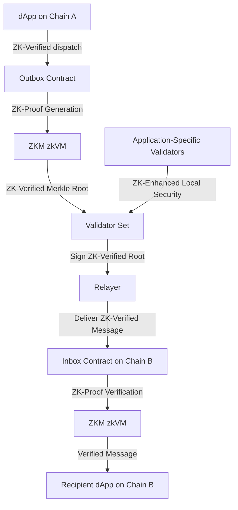
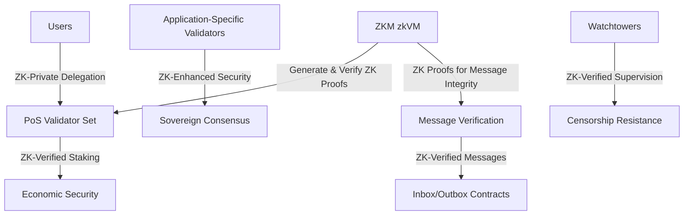

# Hyperlane with ZKM Integration

## Overview of the Category

Hyperlane, enhanced by Zero-Knowledge Machine (ZKM) integration, primarily falls under the **External Verification** category of settlement networks. It uses its own protocol for interchain messaging, which is now augmented with zero-knowledge proofs. However, it also incorporates aspects of **Native Verification** through its direct interaction with connected chains via its on-chain API.

### Category: Generalized Interchain Messaging with Zero-Knowledge Proofs

Hyperlane's focus is on providing a flexible, secure, and efficient interchain messaging protocol, now enhanced by ZKM's zero-knowledge proofs for improved security and privacy.

## Related Information

### Key Features of Hyperlane with ZKM Integration

1. **ZK-Enhanced On-chain API**: The easy-to-integrate API now incorporates ZK proofs for secure and private interchain messaging.
2. **Application-Specific Validators with ZK Proofs**: Applications can add their own validator sets, now leveraging ZK proofs for enhanced security.
3. **Privacy-Preserving Message Observability**: ZKM integration allows for tracking interchain messages while maintaining privacy.
4. **ZK-Verified Network Connectivity**: Support for arbitrary message passing across multiple chains, now with ZK verification.
5. **ZK-Enhanced DAO Governance**: The Hyperlane DAO now uses ZK proofs for more secure and private cross-chain governance.

## Architectural Diagrams

### Hyperlane Interchain Messaging Flow with ZKM

### Hyperlane Security Model with ZKM

## Architectural Advantages

1. **Enhanced Security**: ZKM integration provides cryptographic proofs for all operations, significantly reducing the risk of fraudulent activities in interchain messaging.
2. **Improved Privacy**: Zero-knowledge proofs allow for privacy-preserving message passing and validator operations.
3. **Efficient Cross-Chain Interoperability**: ZK proofs optimize the verification process for interchain messages, potentially reducing latency.
4. **Flexible Security Model**: The combination of ZKM with application-specific validators offers a highly adaptable and robust security framework.
5. **Scalability**: ZKM enables more efficient state transitions and proofs, allowing Hyperlane to handle increased message volumes across chains.

## Architectural Disadvantages

1. **Increased Complexity**: Integrating ZKM adds another layer of complexity to Hyperlane's already sophisticated system.
2. **Potential Performance Overhead**: While ZK proofs enhance security and privacy, they may introduce some computational overhead.
3. **Integration Challenges**: Seamlessly integrating ZKM with existing Hyperlane infrastructure and supported chains could pose technical challenges.
4. **Higher Initial Setup Costs**: Implementing ZKM may require significant initial investment in development and infrastructure for both Hyperlane and dApp developers.
5. **Learning Curve**: Users, developers, and validators may need time to understand and trust the new ZK-enhanced processes.

## Categorization in Settlement Network Types

1. **External Verification**
    - Hyperlane primarily fits here as it uses its own protocol and validator set for message verification.
    - ZKM enhances the external verification process with zero-knowledge proofs.
    
    **Related Projects**: Axelar, Entangle, Initia, Omni, Cycle Network
    
2. **Native Verification**
    - Aspects of Hyperlane's direct interaction with connected chains via its on-chain API align with native verification.
    - ZKM integration allows for more efficient and private native verification on connected chains.
    
    **Related Projects**: Polymer, zkLink
    

## Conclusion

Hyperlane with ZKM integration represents an advanced interchain messaging solution that leverages zero-knowledge proofs to enhance security, privacy, and efficiency. While primarily an externally verified system, it incorporates elements of native verification through its on-chain API, positioning it as a hybrid solution in the settlement network landscape. The integration of ZKM addresses some of Hyperlane's previous limitations while introducing new possibilities for private and secure cross-chain communication.

Resources 

https://blog.li.fi/hyperlane-a-deep-dive-250a930859bf