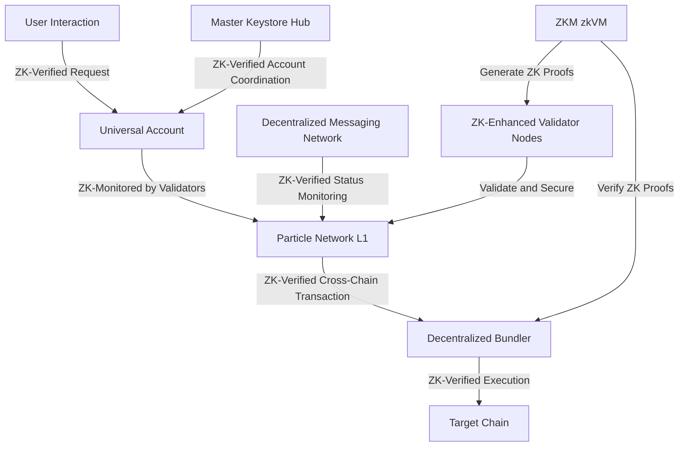
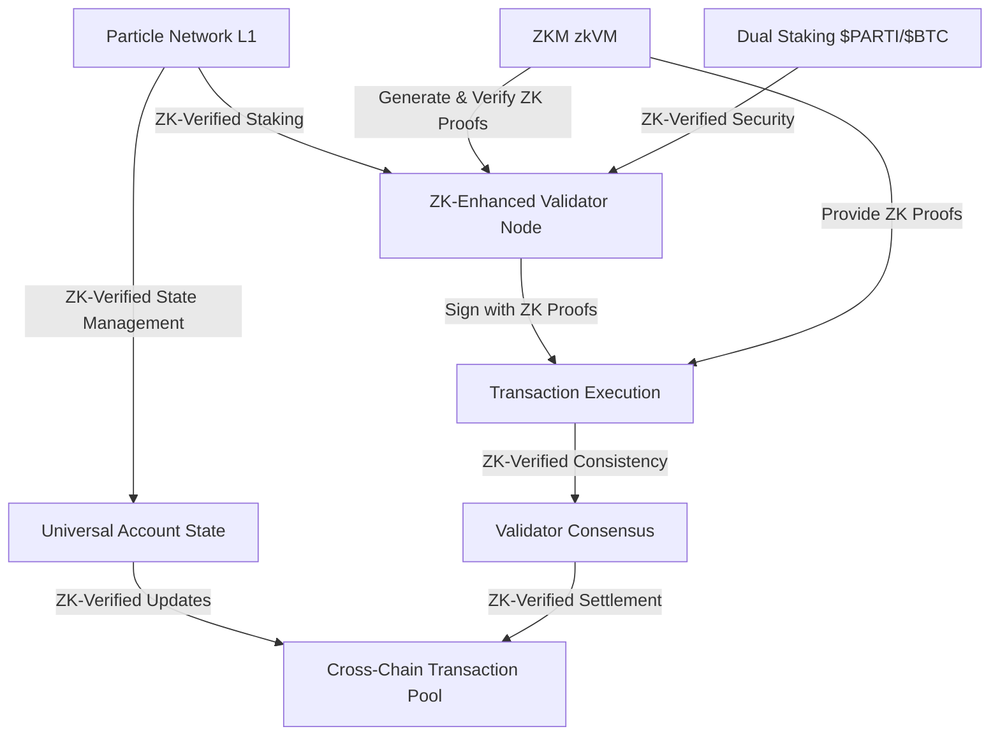

# Particle Network with ZKM Integration

## Overview of the Category

Particle Network, enhanced by Zero-Knowledge Machine (ZKM) integration, primarily falls under the **External Verification** category of settlement networks. It utilizes its own L1 blockchain (Particle Network L1) in addition to the chains where assets are transferred, making it externally verified. However, it also incorporates aspects of **Native Verification** through its Universal Accounts system that interacts with multiple chains.

### Category: Cross-Chain Universal Accounts with Zero-Knowledge Proofs

Particle Network's primary focus is providing Universal Accounts across multiple blockchains, now enhanced by ZKM's zero-knowledge proofs for improved security, privacy, and efficiency.

## Related Information

### Key Features of Particle Network with ZKM Integration

1. **Universal Accounts**: Users can interact with dApps on any chain through a single account, now secured by ZK proofs.
2. **Universal Liquidity**: Cross-chain asset movement facilitated through atomic swaps, enhanced with ZK-verified transactions.
3. **Universal Gas**: Users can pay for gas with any token on any chain, with ZK proofs ensuring the integrity of these complex transactions.
4. **ZK-Enhanced Validator Nodes**: Nodes now use ZK proofs to validate transactions and secure the network more efficiently.
5. **Privacy-Preserving Cross-Chain Interactions**: ZKM integration allows for more private and secure cross-chain operations.

## Architectural Diagrams

### Particle Network Universal Account Flow with ZKM

### Particle Network L1 and Validator Interaction with ZKM

## Architectural Advantages

1. **Enhanced Security**: ZKM integration provides cryptographic proofs for all operations across Universal Accounts, significantly reducing the risk of fraudulent activities.
2. **Improved Privacy**: Zero-knowledge proofs allow for privacy-preserving transactions and cross-chain interactions within Universal Accounts.
3. **Efficient Cross-Chain Interoperability**: ZK proofs optimize the verification process for cross-chain transactions, potentially reducing latency in Universal Account operations.
4. **Scalability**: ZKM enables more efficient state transitions and proofs, allowing Particle Network to handle increased transaction volumes across multiple chains.
5. **Reduced Validator Load**: ZK proofs can simplify validation processes, potentially lowering the computational requirements for validators in the dual staking system.

## Architectural Disadvantages

1. **Increased Complexity**: Integrating ZKM adds another layer of complexity to the already complex Universal Account system.
2. **Potential Performance Overhead**: While ZK proofs enhance security, they may introduce some computational overhead in cross-chain operations.
3. **Integration Challenges**: Seamlessly integrating ZKM with existing Particle Network infrastructure and connected chains could pose technical challenges.
4. **Higher Initial Setup Costs**: Implementing ZKM may require significant initial investment in development and infrastructure across multiple chains.
5. **Learning Curve**: Users and developers may need time to understand and trust the new ZK-enhanced Universal Account processes.

## Categorization in Settlement Network Types

1. **External Verification**
    - Particle Network primarily fits here as it uses its own L1 blockchain for settlement of Universal Account transactions.
    - ZKM enhances the external verification process with zero-knowledge proofs across multiple chains.
    
    **Related Projects**: THORChain, Entangle, Initia, Omni, Cycle Network, Hyperlane
    
2. **Native Verification**
    - Aspects of Particle Network's Universal Accounts system, which interacts directly with connected chains, align with native verification.
    - ZKM integration allows for more efficient native verification on connected chains through the Decentralized Bundler.
    
    **Related Projects**: Polymer, zkLink
    

## Conclusion

Particle Network with ZKM integration represents an advanced cross-chain Universal Account solution that leverages zero-knowledge proofs to enhance security, privacy, and efficiency across multiple blockchains. While primarily an externally verified system through its L1 blockchain, it incorporates strong elements of native verification through its Universal Accounts system, positioning it as a hybrid solution in the settlement network landscape. The integration of ZKM addresses potential security and privacy concerns in cross-chain operations while introducing new possibilities for scalable and efficient blockchain interoperability.

Resources 

https://particle.network/particle-network-l1.html