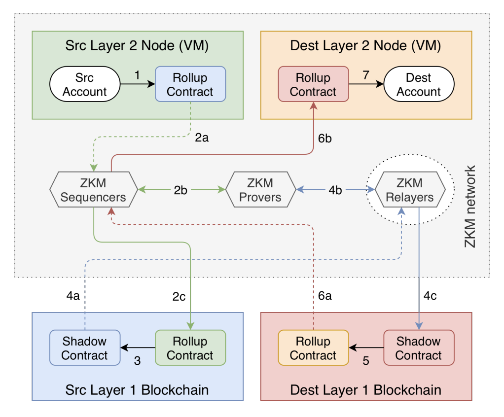

# Entangled Rollup

The Entangled Rollup is a structure that utilizes Layer 2s (L2s) in combination with Validity Proofs (VPs) in order to process cross-chain transactions.

## Overview

# Advantages

- Secure
- Cost Effective
- Interoperable

# Disadvantages

- Complexity
- Long Proof Generation Times

## Resources

- [Whitepaper](https://whitepaper.zkm.io/entangled_rollup_light_paper.pdf)
