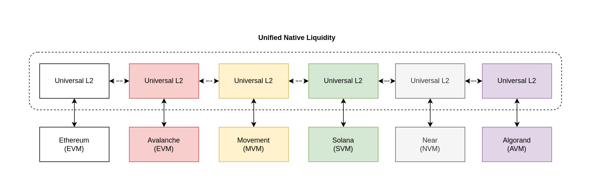
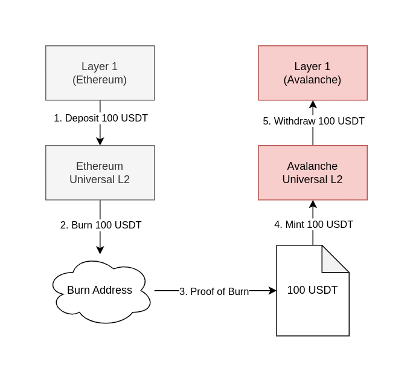

# Universal L2

The Universal L2 (UL2) is a versatile, secure, and cost-effective solution for cross-chain bridging of digital assets between different blockchains. It works by burning tokens on one L2, generating a validity proof of the burn, and using the native mint function of the corresponding L2 to natively mint assets.

## Overview

## Advantages

- Native Liquidity
- Unbounded Mint

## Disadvantages

- Need to have access to the native mint function for the L2
- Need to have a way to manage access control for new L1s and L2s entering this system

## Process

1. The User submits a deposit transaction worth 100 USDT into the bridging contract on ETH L1 and receives 100 USDT on a ETH UL2 from the official bridge contract.
2. The User submits a burn transaction for 100 USDT to the public burn address (e.g. 0xdeaddead..., 0x00000...).
3. The ZKM Nodes generates a Proof of Burn for the User.
4. The User submits the Proof of Burn and the redemption address to redeem to the AVA UL2 which mints 100 USDT from the official bridge contract.
5. The User submits a withdrawal transaction worth 100 USDT from AVA UL2 and receives 100 USDT on AVA L1.

## Notes

- Need to develop a way to manage access to the Universal L2 native liquidity network
